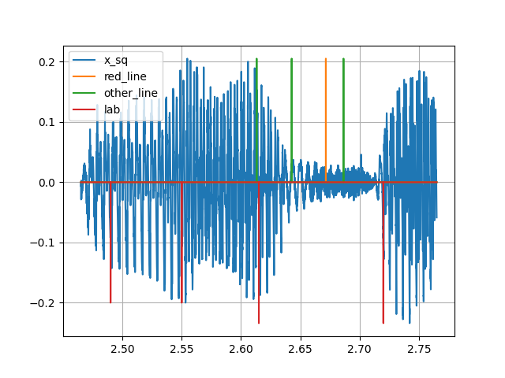

# uv_refine 使用說明

本程式是用來修正voice/unvoice的切割邊界，分為全自動版本和手動介面版本兩種
詳細說明在docs裡面

## 全自動版本
當時開發環境為linux，需在linux下編譯後方能執行

## 手動介面版本

fix_lab_interface.py 使用說明

本程式是用圖形界面觀察voice/unvoice的邊界candidates來手動選擇修正lab

程式中的路徑已改為linux版

執行後可以依需求自行選定檔案，test是方便使用者觀察大概如何使用

所需library如下
    librosa     : 處理音訊
    PyQt5       : 圖形界面
    PyQt5-tools : 圖形界面工具

此界面尚未完善，算是陽春初版，有任何建議或是問題都可以來信s8303232000@gmail.com

